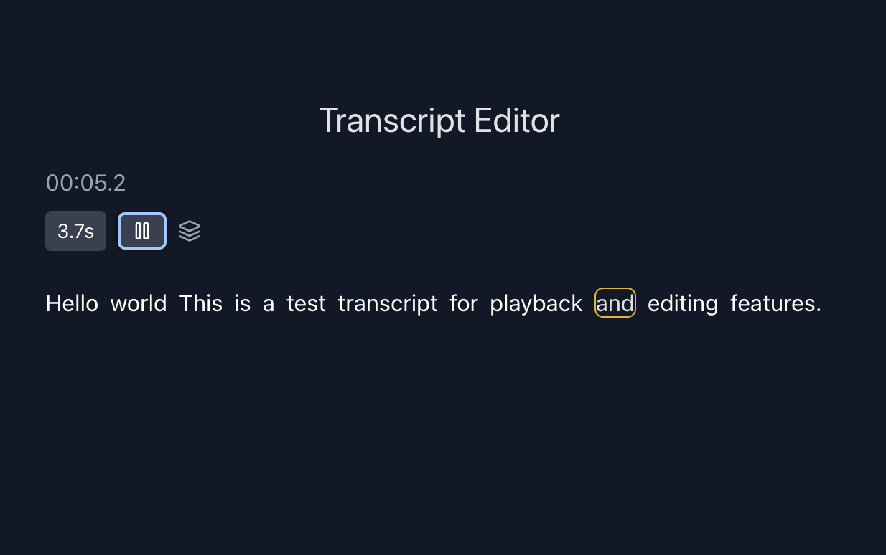
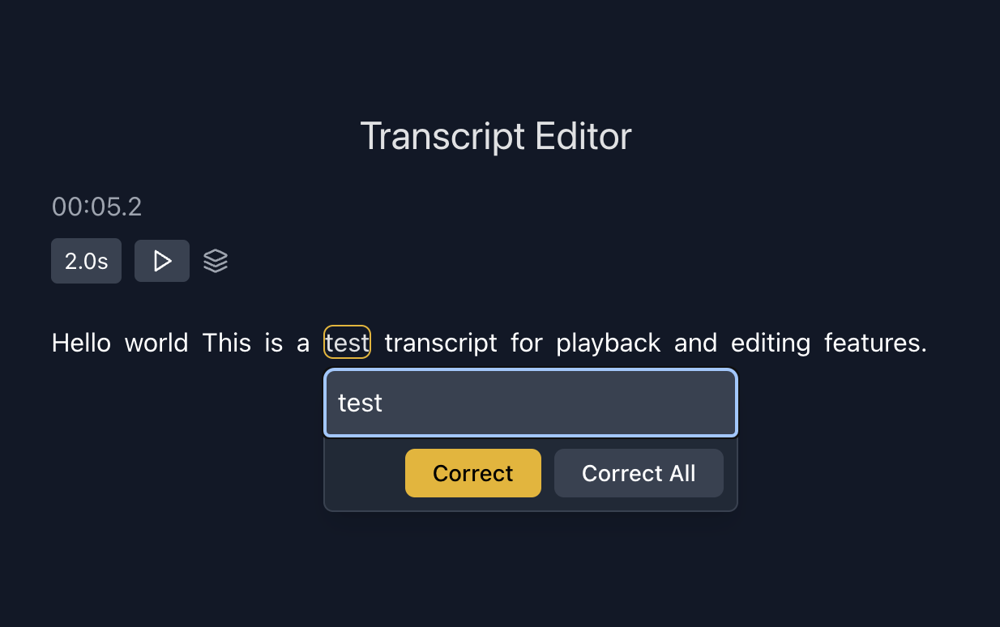

# Transcript Editor

## Objective

The goal of this project is to create a user-friendly transcript editor using React and Tailwind CSS. The editor allows users to interact with a transcript, where each word has a specified start time and duration for playback.

##[Video Demo](https://www.loom.com/share/8a388582583a414e8d21b27cf30be1c9?sid=f59c0802-2ef1-459f-ad79-d42160729b48)

## Screenshots




## Key Features

### 1. Transcript Loading

Each word in the transcript comes with metadata:

- **Start Time**: Indicates when the word playback should begin.
- **Duration**: Specifies how long the word will be highlighted during playback.

### 2. Editing Capabilities

- Users can edit the text of any word within the transcript.
- Word deletions are not allowed, ensuring the integrity of the transcript.

### 3. Playback Functionality

- A play button initiates the sequential highlighting of each word.
- Real-time highlighting provides a visual representation of the words as they are being played back.

Users can also click on any word to edit its text, but they cannot delete words, ensuring the transcript remains intact.

## Tech

- **React**: Used for building the user interface components.
- **Tailwind CSS**: Implemented for styling and responsiveness.

## How to Run

1. Clone the repository:
   ```bash
   git clone [repository-url]
   ```
2. Navigate to the project directory:
   ```bash
   cd transcript-editor
   ```
3. Install dependencies:
   ```bash
   npm install
   ```
4. Start the development server:
   ```bash
   npm run dev
   ```

---

Feel free to reach out if you have any questions or need further assistance!
